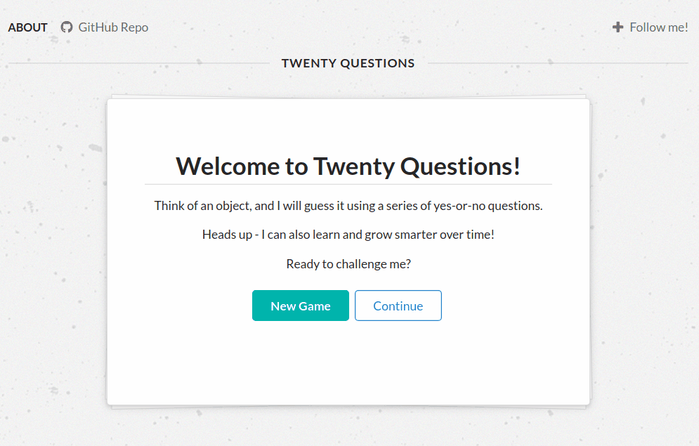
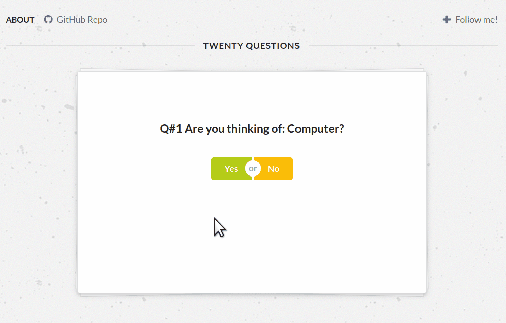

# [Twenty Questions](https://github.com/ayohana/twenty-questions.git)

#### Binary Trees Exercise in JavaScript, 07.22.2020 - 07.28.2020

#### By [**Adela Darmansyah**](https://github.com/ayohana/)

[About](#About) | [Screenshots](#Screenshots) | [How To Install](#How-To-Install) | [Bugs](#Known-Bugs) | [Technologies Used](#Technologies-Used) | [Learning Resources](#Learning-Resources)  | [Contact and Support](#Contact-and-Support)

  

## About

**A web application that implements a yes/no guessing game called "20 Questions."** This game is between user versus computer. The user will think of an object, and the computer will try to guess the object. But beware! As the computer fails to guess, it gets smarter. The computer will save previous objects it tried to guess so it knows the next time the object comes up again! This app ultimately aims to apply the developer's knowledge on binary trees into practice. Click on the following link to play around with the deployed app! [Twenty Questions on Netlify](https://twentyquestions.netlify.app/)

### Winning Conditions

* As the smart computer, I should be able to win the game based on these conditions:
    * The user reaches the last question (a leaf node), then the user clicks "yes" (right answer).
* As the user, I should be able to win the game based on these conditions:
    * I reach the last question (a leaf node), but then I click on "no" (wrong answer).
    * I reach question #20 that is **not** a leaf node, so it doesn't matter what I click on next (computer ran out of chances to ask questions).

## Screenshots

#### Create new game

#### First three rounds of the game

#### Reaching question # 20

#### Cancel create new game

## How To Install

### For local development

* Clone this [repo](https://github.com/ayohana/twenty-questions.git)
* Open the command line and navigate into the repository
    * `npm install` to install all necessary plugins
    * `npm test` to run all tests
    * `npm start` to run the application locally

## Known Bugs

No known bugs at this time.

## Technologies Used

* JavaScript
* HTML
* Markdown
* [jQuery](https://jquery.com/)
* [Semantic UI](https://semantic-ui.com/)
* [Visual Studio Code](https://code.visualstudio.com/)
* Linux VM
* npm
    * Webpack
    * [Jest](https://jestjs.io/docs/en/api)
    * Code Linter
    * _etc.*_

_*Open `package.json` file to see the complete list of all plugins._

## Learning Resources

* This app was inspired by:
    * [Twenty Questions Assignment Prompt](https://web.stanford.edu/class/archive/cs/cs106x/cs106x.1174/assn/twentyQuestions.html)
    * [Twenty-One Questions Assignment Prompt](https://web.stanford.edu/class/archive/cs/cs106x/cs106x.1174/assn/twentyOneQuestions.html)
* [JavaScript Naming Convention](https://www.robinwieruch.de/javascript-naming-conventions)
* [Semantic UI CDN](https://stackoverflow.com/questions/30281258/how-to-use-semantic-ui-cdn)
* ["There is no way to pause a function/loop in JavaScript/jQuery"](https://stackoverflow.com/questions/23754587/wait-for-click-in-loop)
* [MDN: Document.cookie](https://developer.mozilla.org/en-US/docs/Web/API/document/cookie)
* [W3Schools: JavaScript Cookies](https://www.w3schools.com/js/js_cookies.asp)
* [Storing JS objects in cookies](https://www.tutorialspoint.com/How-can-I-store-JavaScript-objects-in-cookies#:~:text=To%20store%20JavaScript%20objects%20in,value%20to%20a%20JSON%20string.)
* [Failed npm install semantic-ui in Linux (does not support newer nodes) - still an open GitHub issue](https://github.com/Semantic-Org/Semantic-UI/issues/6920)
* [Cookies vs Caches](https://medium.com/techblogout/whats-the-difference-between-cache-and-cookies-53e7f4f094bb)
* [`document.cookie` cannot set two cookies at the same time!](https://stackoverflow.com/questions/24865916/how-to-set-multiple-key-value-pairs-to-one-cookie)
* [ESLint: Specify exceptions not to check for usage of variables whose names match a regexp pattern](https://eslint.org/docs/rules/no-unused-vars#varsignorepattern)
* [Step-by-step: How to deploy webpack/npm project using Netlify](https://www.netlify.com/blog/2016/09/29/a-step-by-step-guide-deploying-on-netlify/)

## Contact and Support

Any feedback is welcomed! Email: [adela.yohana@gmail.com](mailto:adela.yohana@gmail.com)
